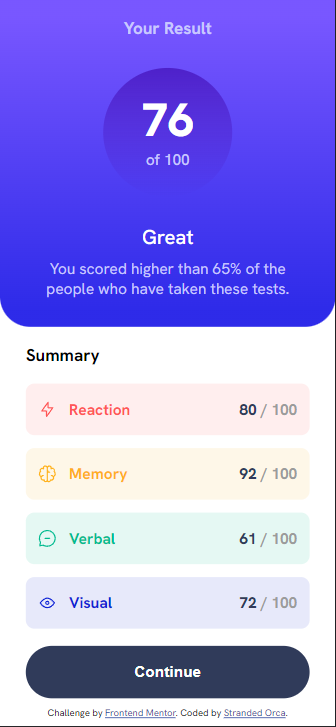
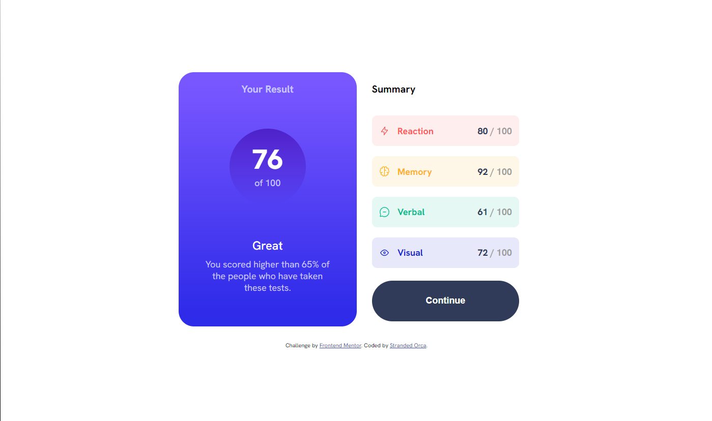

# Responsive Result Page

This is a solution to the [Results summary component challenge on Frontend Mentor](https://www.frontendmentor.io/challenges/results-summary-component-CE_K6s0maV). Frontend Mentor challenges help you improve your coding skills by building realistic projects. 
- Solution URL: [Solution](https://github.com/strandedorca/responsive_result_page)
- Live Site URL: [Live site](https://strandedorca.github.io/responsive_result_page/)

### Features

Users should be able to:

- View the optimal layout for the interface depending on their device's screen size
- See hover and focus states for all interactive elements on the page
- **Bonus**: Use the local JSON data to dynamically populate the content

### Screenshots

### Built with

- Semantic HTML5 markup
- CSS custom properties
- Flexbox
- CSS Grid
- Mobile-first workflow

### What I learned

- Use `em` or `rem` to size elements (even with padding, margin, ...) instead of `px`.
- Use a `.container` and set its width to 100% to wrap around the whole page for responsive design

## Acknowledgments

